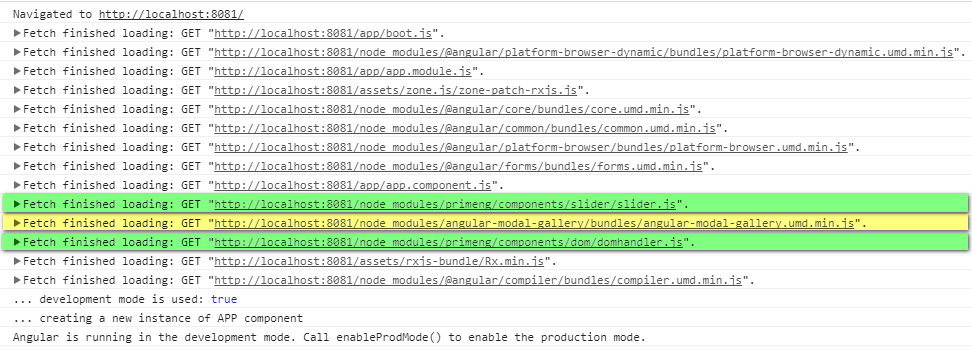
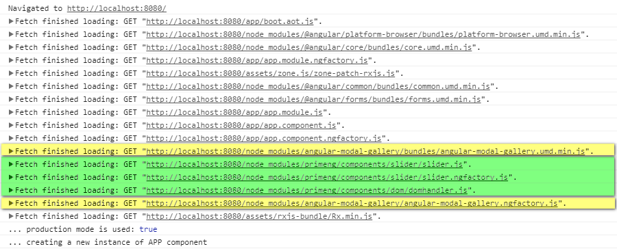
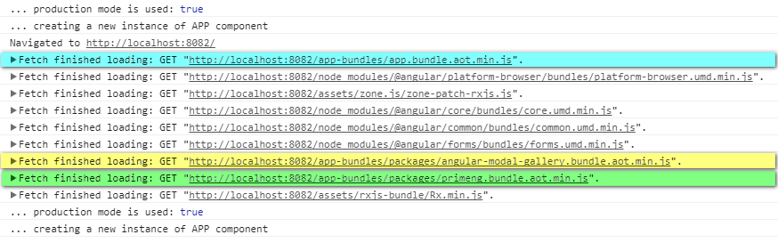
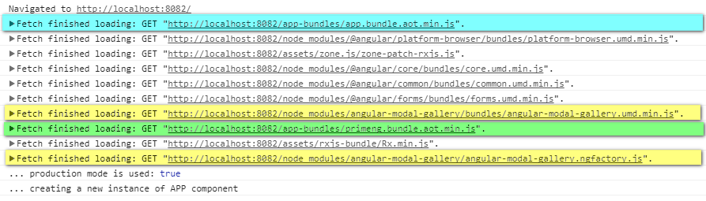

# demo-angular-modal-gallery
The demo of using &lt;angular-modal-gallery&gt; with SystemJS loader in AOT mode of a simple Angular app.

The purpose of this demo is to show how to include `ModalGalleryModule` to Angular application which is compiled via `ngc` compiler and run as an app in AOT mode. It should help to solve the issue described here:  https://github.com/Ks89/angular-modal-gallery/issues/110

To show the difference between `angular-modal-gallery` and `primeng` components, the `slider` PrimeNG component is included.

The main problem for `angular-modal-gallery`: It is not possible to create a single bundle which would include files:
* angular-modal-gallery.js (it is in ES6/ES2015 module format)
* angular-modal-gallery.ngfactory.js (it is in ES5/CommonJS module format)

And it is necessary to load `angular-modal-gallery.umd.min.js` and `angular-modal-gallery.ngfactory.js` separatelly.

**UPDATE 2017-12-16**

After more deep understanding how `angular-modal-gallery` lib is built using `ng-packagr` and comparing it with principles of actual Angular Package Format 5.0, it is clear that there is nothing wrong with the actual version of the lib.

Compiling `angular-modal-gallery` with options `flatModuleId` and `flatModuleOutFile` using `ng-packagr` creates a single flattened UMD JS file -> `bundles\angular-modal-gallery.umd.js` (ES5/UMD) for JIT mode and also `angular-modal-gallery.js` (ES6/ES2015), `angular-modal-gallery.metadata.json`, `angular-modal-gallery.ngsummary.json` which are published resources for AOT compilation in a context of a whole Angular application (its configuration) which uses this lib.

If an application is using SystemJS loader and setting for ES5/CJS modules then it is possible to do the following steps:
* Run: `npm run ngc` for compiling the app for AOT and this step also cretes `angular-modal-gallery.ngfactory.js` (ES5/CJS) file in `node_modules\angular-modal-gallery` directory.
* Run: `gulp removing-decorators-from-packages` for elimination of JIT decorators from `bundles\angular-modal-gallery.umd.js` whic are not necessary for run-time of the application in AOT mode. This step creates the new file `bundles\angular-modal-gallery.aot.umd.js` instead of re-writing the original one.
* Run: `gulp bundles:aot` for creating bundles of the app for AOT which includes also a new single bundle that includes `bundles\angular-modal-gallery.aot.umd.js` and `angular-modal-gallery.ngfactory.js` files and this bundle is mapped in `systemjs.config.bundles.js`, so an app can load only one single bundle for all parts of `angular-modal-gallery` package resources.

**How to run this demo:**

* Make a local clone of this repo
* Run: `npm install`

**For JIT:**
* Run: `npm run tsc` for compiling the app for JIT
* Run: `gulp serve` for runnig the app on `localhost:8080` in JIT mode

**For AOT:**
* Run: `npm run ngc` for compiling the app for AOT
* Run: `gulp serve:aot` for runnig the app on `localhost:8081` in AOT mode

**For BUNDLED AOT:**
* Run: `npm run ngc` for compiling the app for AOT
* Run: `gulp removing-decorators-from-packages` for elimination of JIT decorators
* Run: `gulp bundles:aot` for creating bundles of the app for AOT
* Run: `gulp serve:bundles` for runnig the app on `localhost:8082` in AOT mode

The previous status without bundling of `angular-modal-gallery` package:

